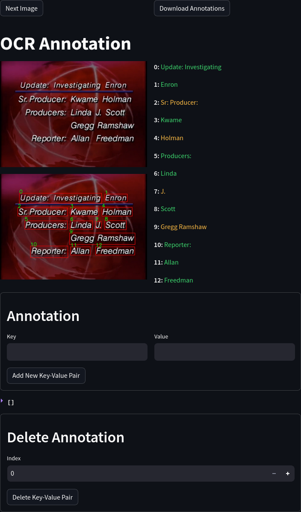

# Annotation Environment for Credits and Slates parsing

## Installation
`pip install -r requirements.txt`

## Run Annotation Environment
`streamlit run main.py <directory_of_images>`

## Running in Container
* `docker build -t annotation_env .`
* `docker run -p 8501:8501 -v <directory_of_images>:/app/images annotation_env <directory_of_images>:<annotation_output_directory>`

## Usage
* For each image, annotate each Key-Value pair in the Annotation container
* After annotating whole image, click `Download Annotations` to download the annotations in JSON format
* Click `Next Image` to move to next image
* If there is an error in the annotations for a given image, set the index in the `Delete Annotation` container to
the index of the annotation to be deleted and click `Delete Key-Value Pair`
* OCR output is color coded to indicate the confidence of the OCR output. 
  * Green indicates high confidence
  * Orange indicates medium confidence
  * Red indicates low confidence

## Screenshot
